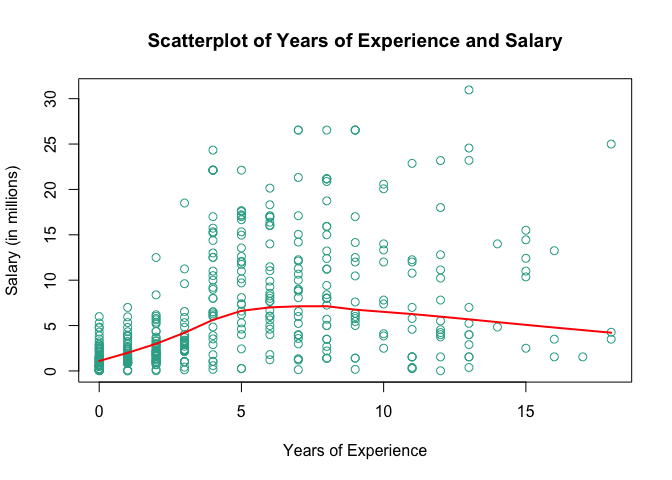

HW01 - More Vectors
================
Doug Koerber

### Importing Data

``` r
knitr::knit_hooks$set(inline = as.character)
load("data/nba2017-salary-points.RData")
ls()
```

    ## [1] "experience" "player"     "points"     "points1"    "points2"   
    ## [6] "points3"    "position"   "salary"     "team"

### 1) Data Preprocessing

#### Salary in millions of dollars

``` r
salary_mil = salary / 1000000
salary_mil = round(salary_mil, digits = 2)
head(salary_mil, 3)
```

    ## [1] 26.54 12.00  8.27

#### Replacing "R" with 0

``` r
rookie_logic <- experience == "R"
experience_int = replace(experience, rookie_logic, 0)
experience_int = as.integer(experience_int)
rm(rookie_logic)
head(experience_int, 10)
```

    ##  [1]  9 11  6  0  9  5  4  2  0  6

#### Position Factor

``` r
position_fac = factor(position, levels = c("C", "SF", "PF", "SG", "PG"), labels = c("center", "small_fwd", "power_fwd", "shoot_guard", "point_guard"))
head(position_fac, 5)
```

    ## [1] center      power_fwd   shoot_guard point_guard small_fwd  
    ## Levels: center small_fwd power_fwd shoot_guard point_guard

##### Position Frequencies

``` r
table(position_fac)
```

    ## position_fac
    ##      center   small_fwd   power_fwd shoot_guard point_guard 
    ##          89          83          89          95          85

``` r
table(position_fac) / length(position_fac)
```

    ## position_fac
    ##      center   small_fwd   power_fwd shoot_guard point_guard 
    ##   0.2018141   0.1882086   0.2018141   0.2154195   0.1927438

### 2) Scatterplot of Points and Salary

``` r
plot(points, salary_mil, cex = 1.1, col = rgb(50, 172, 150, maxColorValue = 255), xlab = 'Points', ylab = 'Salary (in millions)', main = 'Scatterplot of Points and Salary')
```


-   The above plot shows a weak, but noticeable, positive relationship between points and salary. Most players are clustered below $5,000,000 and 500 points, whereas the league's "all-stars" tend to score more points and receive higher salaries. Unfortunately, not everyone can be an "all-star."

### 3) Correlation between Points and Salary

For this exercise, *Points* is assigned to the variable *X*, and *Salary* is assigned to the variable *Y*.

``` r
n = 441
xbar = (sum(points)) / n
ybar = (sum(salary_mil)) / n
var_x = (1/(n - 1)) * (sum((points - xbar)^2))
var_y = (1/(n - 1)) * (sum((salary_mil - ybar)^2))
sd_x = sqrt(var_x)
sd_y = sqrt(var_y)
cov_xy = (1/(n - 1)) * (sum((points - xbar)*(salary_mil - ybar)))
cor_xy = cov_xy / (sd_x * sd_y)
```

-   *xbar* = 546.61
-   *ybar* = 6.19
-   *var\_x* = 239136.24
-   *var\_y* = 43.2
-   *sd\_x* = 489.02
-   *sd\_y* = 6.57
-   *cov\_xy* = 2046.42
-   *cor\_xy* = 0.64

### 4) Simple Linear Regression

``` r
b1 = cor_xy * (sd_y / sd_x)
b0 = ybar - (b1 * xbar)
yhat = b0 + (b1 * points)
```

-   *b1* = 0.0086
-   *b0* = 1.5091

``` r
head(yhat, 5)
```

    ## [1] 9.655880 5.959011 9.159542 1.594652 3.751159

#### Summary Statistics of Y-hat

``` r
summary(yhat)
```

    ##    Min. 1st Qu.  Median    Mean 3rd Qu.    Max. 
    ##   1.509   2.844   5.206   6.187   8.184  23.399

#### Regression Equation: Inline Code

yhat = 1.5091 + (0.0086 \* points)

#### *b1*

b1 is the effect of points on salary in millions, or the X variable on the Y variable. Because our salary is in millions, we can see that an increase in 1 point scored would cause a 0.0086 millions of dollars increase in salary.

#### *b0*

b0 is the y-intercept of our regression line. This means that assuming a player scores 0 points in a season, their predicted salary is 1.5091 millions of dollars.

#### Predicted Salaries

-   X = 0 points: $1.5091 Million
-   X = 100 points: $2.3648 Million
-   X = 500 points: $5.7879 Million
-   X = 1000 points: $10.0666 Million
-   X = 2000 points: $18.6242 Million

### 5) Plotting the Regression Line

``` r
plot(points, salary_mil, cex = 1.1, col = rgb(50, 172, 150, maxColorValue = 255), xlab = 'Points', ylab = 'Salary (in millions)', main = 'Scatterplot of Points and Salary', abline(b0, b1, lwd = 2, col = "Blue"))
lines(lowess(points, salary_mil), col = "Red", lwd = 2)
text(2400, 19, labels = "Regression", col = "Blue")
text(2200, 28, labels = "Lowess", col = "Red")
```


### 6) Regression Residuals and Coefficient of Determination

#### Vector of Residuals

``` r
e_salary_mil = salary_mil - yhat
summary(e_salary_mil)
```

    ##    Min. 1st Qu.  Median    Mean 3rd Qu.    Max. 
    ## -14.187  -2.792  -1.095   0.000   2.556  18.814

#### Residual Sum of Squares

``` r
RSS = sum(e_salary_mil^2)
```

RSS = 11300.45

#### Total Sum of Squares

``` r
TSS = sum((salary_mil - ybar)^2)
```

TSS = 19005.91

#### R^2

``` r
R_sq = 1 - (RSS / TSS)
```

R^2 = 0.41

### 7) Exploring Position and Experience

#### Scatterplot of Years of Experience and Salary

``` r
plot(experience_int, salary_mil, cex = 1.1, col = rgb(50, 172, 150, maxColorValue = 255), xlab = 'Years of Experience', ylab = 'Salary (in millions)', main = 'Scatterplot of Years of Experience and Salary')
lines(lowess(experience_int, salary_mil), col = "Red", lwd = 2)
```



-   The above plot shows the estimated value of *salary* based on *years of experience*. The red line, a *lowess* line, is a locally-weighted regression function, meaning that it shows estimated values for salary based on some local weighting of *years of experience*. Values closer to the point being estimated are given more weight in a *lowess regression method*.

#### 3D Scatterplot of Points, Experience, and Salary in Millions

``` r
library('scatterplot3d')
scatterplot3d(points, experience_int, salary_mil, color = rgb(50, 172, 150, maxColorValue = 255), xlab = 'Points', ylab = 'Years of Experience', zlab = 'Salary (in Millions)', main = 'Scatterplot of Points, Experience, and Salary', cex.symbols = 1.1)
```


-   The above graph is a 3-dimensional visualization of *salary*, *points*, and *years of experience*. This graph gives us 3 variables to compare with one another, rather than the 2 in a basic scatterplot. A player's *points* control how far right the dot is placed, their *salary* controls how high up the dot is placed, and their *years of experience* controls how far back the dot is placed.

#### Boxplot of Salary conditional upon Position

``` r
boxplot(salary_mil ~ position_fac, xlab = 'Position', ylab = 'Salary (in Millions)')
```


-   The above chart shows different boxplots for the salaries of each position in the NBA. The thick black line represents the median, the lower-limit of the box represents the cutoff for the 1st quartile, the upper-limit represents the cutoff for the 3rd quartile, and the whiskers show the minimum and maximum values. The box itself represents the interquartile range. Note: the whiskers do not cover outliers, which instead are shown as dots above the tip of the whisker.

### 8) Comments and Reflections

-   **What things were hard, even though you saw them in class?**
    -   It was difficult creating a boxplot with the different boxes for each level of a factor. I had to research the function more in-depth in the `Help` section of R.
-   **What was easy(-ish) even though we haven’t done it in class?**
    -   Using the `scatterplot3d` was easy and very intuitive. It was very similar to the regular `plot` function, just with the added *z* variable.
-   **If this was the first time you were using git, how do you feel about it?**
    -   I've used git before in lab03, but I'm still not entirely comfortable with it. I think more clarification on where the files go and what happens to the files when we type in *git add*, *git commit -m "message here"*, and *git push origin master*. I'm also a bit confused on how the file layout is supposed to work, with graphs being stored in some "magically" created directory. How is that directory made? Is it made in the current working directory?
-   **If this was the first time using GitHub, how do you feel about it?**
    -   Although I'm not entirely familiar with all of GitHub, I think it will be a very useful tool for any sort of project/research/job I may do in the future. I am unsure of how to download files straight from GitHub, do we just copy and paste the *raw* into an empty Rmd file?
-   **Did you need help to complete the assignment? If so, what kind of help? Who helped you?**
    -   I didn't need help to complete the assignment, although I'm sure I could've saved about 30-45 minutes if I had someone to help. Really, only google and the `Help` panel in R helped me.
-   **How much time did it take to complete this HW?**
    -   It took me maybe 5-6 hours to complete this homework.
-   **What was the most time consuming part?**
    -   The most time consuming part of this homework was playing with the graphs to present the data the way I wanted to see it. For example, making my own color for the points in my plots was something that took a bit of time, but I wanted to learn how to do it.
-   **Was there anything that you did not understand? or fully grasped?**
    -   I don't fully grasp the *Lowess* line. I'm pretty familiar with the basic OLS regression statistics (I've taken Econ 140), so it was a nice refresher of the information I learned in that. I'm also not sure that the way I've done certain things, like manipulate the *Position* factor to display more detailed position names rather than "C", "PG", etc., is the most efficient way possible. I'm sure I'll become more comfortable with the differences between vectors, factors, and different data types as the course goes on.
-   **Was there anything frustrating in particular?**
    -   Finding out how to create the boxplot with different boxes for each level of the *Position* factor was slightly frustrating. I also would really like to know more about the *Lowess* line.
-   **Was there anything exciting? Something that you feel proud of? (Don’t be shy, we won’t tell anyone).**
    -   I feel proud of the finished result. I've actually sent my analysis to a few friends who are interested in basketball and they enjoyed looking over it. I can't wait to continue working with data in R, I really like how easy it is to display things!
