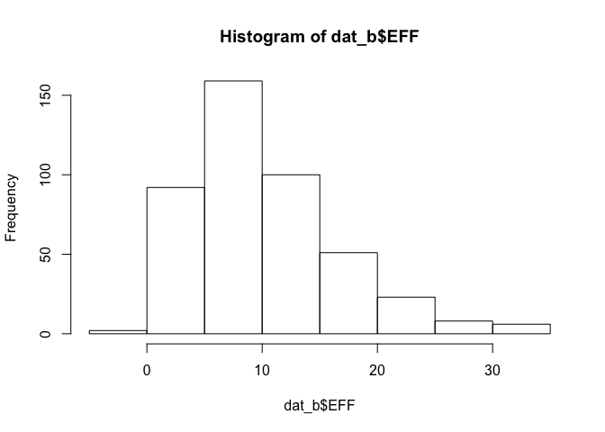
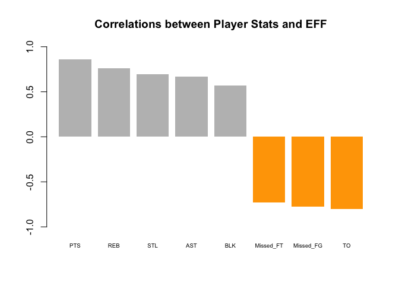
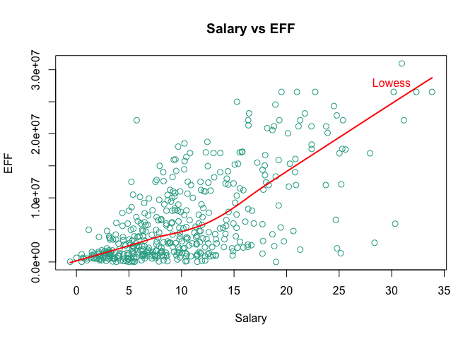
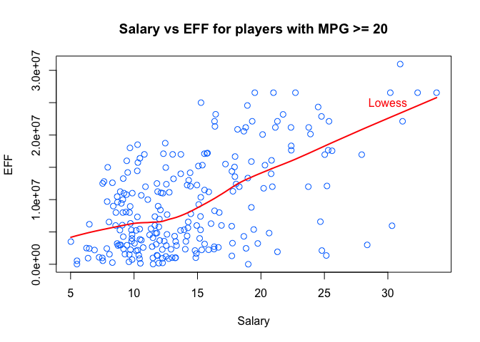

hw02-doug-koerber
================
Doug Koerber

### 2) Importing Data Into R

``` r
library("readr")
library("dplyr")
```

    ## 
    ## Attaching package: 'dplyr'

    ## The following objects are masked from 'package:stats':
    ## 
    ##     filter, lag

    ## The following objects are masked from 'package:base':
    ## 
    ##     intersect, setdiff, setequal, union

#### Import Using `base` Functions

``` r
base_types <- c('Player' = 'character', 'Team' = 'character', 'Experience' = 'character', 'Position' = 'factor', 'Salary' = 'double')
dat_b = read.csv('~/Desktop/stat133-hws-fall17/hw02/data/nba2017-player-statistics.csv', colClasses = base_types)
```

#### Import Using `readr` Functions

``` r
readr_types <- list(Player  = 'c', Team = 'c',  Position = col_factor(c("C", "PF", "PG",
"SF", "SG")),   Experience = 'c',   Salary = col_double(),  Rank = 'i', Age = 'i', GP = 'i', GS = 'i', MIN = 'i', FGM = 'i', FGA = 'i', Points3 = 'i', Points3_atts = 'i',  Points2 = 'i', Points2_atts = 'i', FTM = 'i',   FTA = 'i', OREB = 'i', DREB = 'i',  AST = 'i', STL = 'i',   BLK = 'i', TO = 'i')
dat_r = read_csv('~/Desktop/stat133-hws-fall17/hw02/data/nba2017-player-statistics.csv', col_type = readr_types)
```

### 3) Replacing R with 0

``` r
dat_b$Experience[dat_b$Experience == 'R'] = 0
dat_b$Experience = as.integer(dat_b$Experience)
```

### 4) Performance of Players

#### Adding New Players Variables

``` r
dat_b <- mutate(dat_b, Missed_FG = FGA - FGM, Missed_FT = FTA - FTM, PTS = (3 * Points3) + (2 * Points2) + FTM, REB = OREB + DREB, MPG = MIN / GP)
```

#### Adding and Checking EFF

``` r
dat_b <- mutate(dat_b, EFF = (PTS + REB + AST + STL + BLK - Missed_FG - Missed_FT - TO) / GP)
summary(dat_b$EFF)
```

    ##    Min. 1st Qu.  Median    Mean 3rd Qu.    Max. 
    ##  -0.600   5.452   9.090  10.137  13.247  33.840

``` r
hist(dat_b$EFF)
```



#### Display name, team, salary, and EFF value of the top-10 players by EFF in decreasing order

``` r
top_10 <- head(dat_b[order(dat_b$EFF, decreasing = TRUE), c('Player', 'Team', 'Salary', 'EFF')], 10)
top_10
```

    ##                    Player Team   Salary      EFF
    ## 305     Russell Westbrook  OKC 26540100 33.83951
    ## 256          James Harden  HOU 26540100 32.34568
    ## 355         Anthony Davis  NOP 22116750 31.16000
    ## 28           LeBron James  CLE 30963450 30.97297
    ## 404    Karl-Anthony Towns  MIN  5960160 30.32927
    ## 228          Kevin Durant  GSW 26540100 30.19355
    ## 74  Giannis Antetokounmpo  MIL  2995421 28.37500
    ## 359      DeMarcus Cousins  NOP 16957900 27.94118
    ## 110          Jimmy Butler  CHI 17552209 25.60526
    ## 119      Hassan Whiteside  MIA 22116750 25.36364

#### Names of Players with EFF &lt; 0

``` r
dat_b$Player[dat_b$EFF < 0]
```

    ## [1] "Patricio Garino"

#### Correlations Between EFF and EFF Formula Variables

``` r
EFF_PTS = cor(dat_b$EFF, dat_b$PTS)
EFF_REB = cor(dat_b$EFF, dat_b$REB)
EFF_AST = cor(dat_b$EFF, dat_b$AST)
EFF_STL = cor(dat_b$EFF, dat_b$STL)
EFF_BLK = cor(dat_b$EFF, dat_b$BLK)
EFF_Missed_FG = -cor(dat_b$EFF, dat_b$Missed_FG)
EFF_Missed_FT = -cor(dat_b$EFF, dat_b$Missed_FT)
EFF_TO = -cor(dat_b$EFF, dat_b$TO)
```

#### Displaying Computed Correlation Coefficients in Descending Order

##### Creating a Data Frame of Correlation Coefficients

``` r
cor_dat <- data.frame(cor_variables = c('PTS', 'REB', 'AST', 'STL', 'BLK', 'Missed_FG', 'Missed_FT', 'TO'), cor_coef = c(EFF_PTS, EFF_REB, EFF_AST, EFF_STL, EFF_BLK, EFF_Missed_FG, EFF_Missed_FT, EFF_TO))
```

##### Displaying Computed Correlation Coefficients

``` r
cor_dat <- cor_dat[order(cor_dat$cor_coef, decreasing = TRUE), ]
cor_dat
```

    ##   cor_variables   cor_coef
    ## 1           PTS  0.8588644
    ## 2           REB  0.7634501
    ## 4           STL  0.6957286
    ## 3           AST  0.6689232
    ## 5           BLK  0.5679571
    ## 7     Missed_FT -0.7271456
    ## 6     Missed_FG -0.7722477
    ## 8            TO -0.8003289

``` r
barplot(cor_dat$cor_coef, names.arg = cor_dat$cor_variables, border = NA, main = "Correlations between Player Stats and EFF", cex.names = 0.6, ylim = c(-1.0, 1.0), col = ifelse(cor_dat$cor_coef<0, "Orange", "Gray"))
```



### 5) Efficiency and Salary

``` r
plot(x = dat_b$EFF, y = dat_b$Salary, cex = 1.1, col = rgb(50, 172, 150, maxColorValue = 255), xlab = 'Salary', ylab = 'EFF', main = 'Salary vs EFF')
lines(lowess(x = dat_b$EFF, y = dat_b$Salary), col = "Red", lwd = 2)
text(30, 28000000, labels = "Lowess", col = "Red")
```



#### Data Frame of MPG &gt; 20

``` r
players2 <- dat_b[dat_b$MPG >= 20, ]
```

#### Scatterplot of Salary and Efficiency Using `players2`

``` r
plot(x = players2$EFF, y = players2$Salary, cex = 1.1, col = rgb(0, 120, 255, maxColorValue = 255), xlab = 'Salary', ylab = 'EFF', main = 'Salary vs EFF for players with MPG >= 20')
lines(lowess(x = players2$EFF, y = players2$Salary), col = "Red", lwd = 2)
text(30, 25000000, labels = "Lowess", col = "Red")
```



#### Linear Correlation Coefficient of Salary and Efficiency

``` r
sal_EFF <- cor(players2$Salary, players2$EFF)
```

cor(Salary, EFF) = 0.54
