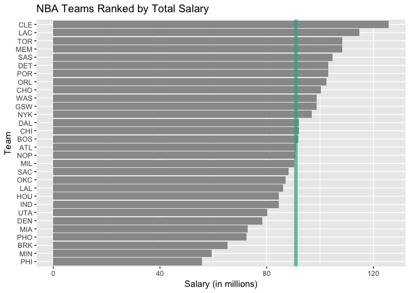

hw03-doug-koerber
================
Doug Koerber

``` r
library(readr)
library(dplyr)
```

    ## 
    ## Attaching package: 'dplyr'

    ## The following objects are masked from 'package:stats':
    ## 
    ##     filter, lag

    ## The following objects are masked from 'package:base':
    ## 
    ##     intersect, setdiff, setequal, union

``` r
library(ggplot2)
```

### Basic Rankings

#### Salary

``` r
teams <- read_csv("../data/nba2017-teams.csv")
```

    ## Parsed with column specification:
    ## cols(
    ##   team = col_character(),
    ##   experience = col_integer(),
    ##   salary = col_double(),
    ##   points3 = col_integer(),
    ##   points2 = col_integer(),
    ##   free_throws = col_integer(),
    ##   points = col_integer(),
    ##   off_rebounds = col_integer(),
    ##   def_rebounds = col_integer(),
    ##   assists = col_integer(),
    ##   steals = col_integer(),
    ##   blocks = col_integer(),
    ##   turnovers = col_integer(),
    ##   fouls = col_integer(),
    ##   efficiency = col_double()
    ## )

``` r
ggplot(data = teams, aes(x = reorder(team, salary), y = salary)) +
  geom_bar(stat = "identity", fill = "gray60") +
  geom_hline(aes(yintercept = mean(salary)), col = rgb(50, 172, 150, maxColorValue = 255), size = 2, alpha = 0.7) +
  coord_flip() +
  labs(x = "Team", y = "Salary (in millions)", title = "NBA Teams Ranked by Total Salary")
```



#### Total Points

``` r
ggplot(data = teams, aes(x = reorder(team, points), y = points)) +
  geom_bar(stat = "identity", fill = "gray60") +
  geom_hline(aes(yintercept = mean(points)), col = rgb(50, 172, 150, maxColorValue = 255), size = 2, alpha = 0.7) +
  coord_flip() +
  labs(x = "Team", y = "Total Points", title = "NBA Teams Ranked by Total Points")
```


#### Efficiency

``` r
ggplot(data = teams, aes(x = reorder(team, efficiency), y = efficiency)) +
  geom_bar(stat = "identity", fill = "gray60") +
  geom_hline(aes(yintercept = mean(efficiency)), col = rgb(50, 172, 150, maxColorValue = 255), size = 2, alpha = 0.7) +
  coord_flip() +
  labs(x = "Team", y = "Total Efficiency", title = "NBA Teams Ranked by Total Points")
```


#### Descriptions

-   **Salary:** Cleveland has the highest salary, although this might be due to the salary paid to Lebron James - the highest paid player in the NBA. The Golden State Warriors, champions of the 2016-2017 season, are mixed in further down the ranking, proving that money is not the only thing needed to have a championship winning team. Philadelphia is the lowest paying team in the NBA, falling below average by about $40 million.
-   **Total Points:** The Golden State Warriors scored the most points in the league, whereas the Sacramento Kings scored the fewest. By a purely graphical analysis, it appears that the majority of teams scored above-average for the entire season, and only a few teams scored abnormally low point totals thus dragging down the average.
-   **Efficiency:** The Golden State Warrios have the second highest total efficiency for all teams in the NBA, surpassed only by the Cleveland Cavaliers. Most teams fell below average efficiency for the league, once again due to only a few teams scoring abnormally high for efficiency and raising the average.

``` r
pc1 <- data.frame(teams$points3, teams$points2, teams$free_throws, teams$off_rebounds, teams$def_rebounds, teams$assists, teams$steals, teams$blocks, teams$turnovers, teams$fouls)
pca <- prcomp(pc1, scale. = TRUE)
names(pca)
```

    ## [1] "sdev"     "rotation" "center"   "scale"    "x"

``` r
eigs <- data.frame(eigenvalue = pca$sdev^2, prop = pca$sdev^2 / sum(pca$sdev^2))
eigs <- round(mutate(eigs, cumprop = cumsum(prop)), 4)
```

``` r
pca_plot <- data.frame(teams$team, pca$x)
ggplot(data = pca_plot, aes(x = PC1, y = PC2)) +
  geom_text(aes(label = teams$team)) +
  geom_vline(xintercept = 0, col = "gray50") +
  geom_hline(yintercept = 0, col = "gray50") +
  labs(title = "PCA Plot: PC1 and PC2")
```


### Scaled PC1 Scores

``` r
pca_plot <- mutate(pca_plot, PC1_scaled = 100 * ((PC1 - min(PC1)) / (max(PC1) - min(PC1))))
ggplot(data = pca_plot, aes(x = reorder(teams.team, PC1_scaled), y = PC1_scaled)) +
  geom_bar(stat = "identity", fill = "gray60") +
  coord_flip() +
  labs(x = "Team", y = "PC1 (Scaled to 100)", title = "NBA Teams Ranked by Scaled PC1")
```


#### Descriptions

-   **PC1:** A scaled PC1 index shows that the Golden State Warriors are by far the best team in the league, and the Sacramento Kings are the worst. Recall from earlier that GSW is also the top point-scoring team in the league, and SAC is the worst point-scoring team. This, although not the only factor in determing rank for PC1, shows that total points have an effect on PC1's ranking. Cleveland is close to the bottom of the PC1 ranking, proving that paying a team higher salaries does not gaurantee a higher ranking.

### Comments and Reflections

-   Was this your first time working on a project with such file structure? If yes, how do you feel about it?
    -   This was my first time working with such a file structure, and I really like it. Having a set layout for varying files feels very organized, and I know that keeping data/code/output organized is very important because it allows the user to quickly and easily access anything used during the project in the future.
-   Was this your first time using relative paths? If yes, can you tell why they are important for reproducibility purposes?
    -   No, I have used relative paths before. However, they are important for reproducability because it allows you to run code (such as the R script) easily whenever you want to, no matter if the `hw03` folder has been moved to a new location.
-   Was this your first time using an R script? If yes, what do you think about just writing code?
    -   This was my first time using an R script (outside of lab), and I think I prefer writing in Rmd files. That being said, I prefer to write data cleaning code in an R script file as opposed to an Rmd file because I feel that Rmd files follow a different layout than R script files, and I want to keep the two "layouts" separate.
-   What things were hard, even though you saw them in class/lab?
    -   Running my own PCA was difficult, and I felt a little lost at various points in doing so. I remember seeing Professor Sanchez run through PCA in class, but actually performing it myself was pretty daunting. I think it would help to have a better idea of the math behind what is happening.
-   What was easy(-ish) even though we haven’t done it in class/lab?
    -   Creating graphs with `ggplot` was easy, and adding new layers is very intuitive. Playing around with the layers and their graphical options is one of my favorite things about `ggplot`, it's so easy.
-   Did anyone help you completing the assignment? If so, who?
    -   No one helped me complete this assignment.
-   How much time did it take to complete this HW?
    -   This homework assignment took maybe 10-11 hours to complete.
-   What was the most time consuming part?
    -   The most time consuming part of this homework was by far the PCA. See above for reasons.
-   Was there anything interesting?
    -   It was interesting to see how creating new variables and merging data tables can lead to such an easy-to-read final report, and `ggplot`'s graphs make the data visually appealing.
