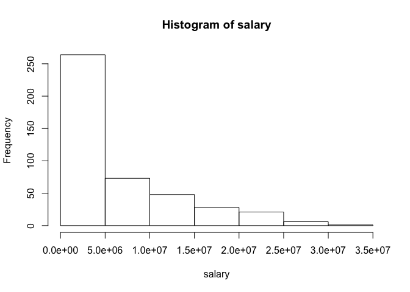
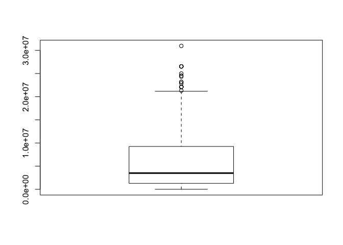
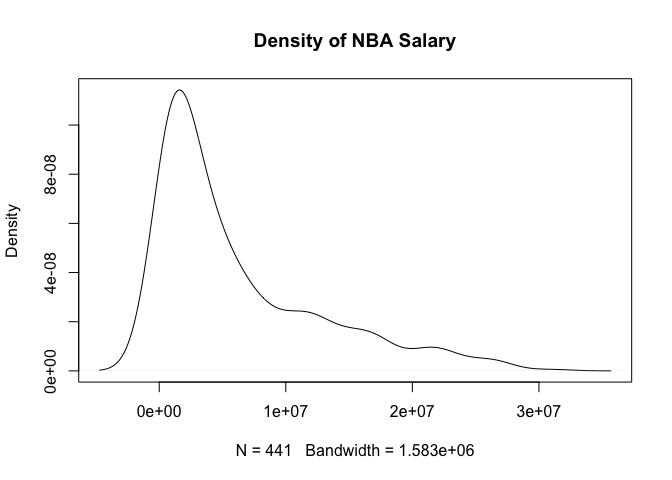
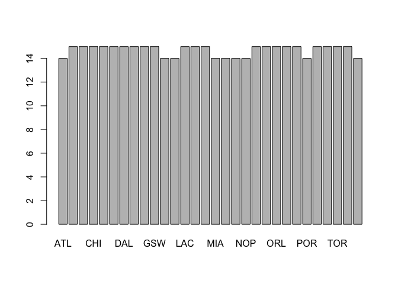

Warmup 2
================
Doug Koerber

``` r
load('~/Desktop/stat133/stat133-hws-fall17/warmup02/data/nba2017-salary-points.RData')
ls()
```

    ## [1] "experience" "player"     "points"     "points1"    "points2"   
    ## [6] "points3"    "position"   "salary"     "team"

### Quantitative Variable: Salary

``` r
summary(salary)
```

    ##     Min.  1st Qu.   Median     Mean  3rd Qu.     Max. 
    ##     5145  1286160  3500000  6187014  9250000 30963450

``` r
mean(salary)
```

    ## [1] 6187014

``` r
sd(salary)
```

    ## [1] 6571890

``` r
min(salary)
```

    ## [1] 5145

``` r
max(salary)
```

    ## [1] 30963450

``` r
median(salary)
```

    ## [1] 3500000

``` r
quantile(salary, probs = c(0.25, 0.5, 0.75, 1))
```

    ##      25%      50%      75%     100% 
    ##  1286160  3500000  9250000 30963450

``` r
hist(salary)
```



``` r
boxplot(salary)
```



``` r
plot(density(salary), main = "Density of NBA Salary")
```



-   What are the typical values in each vector?
    -   On average, most players make about 546 points in a season, consisting of approximately 92 free throws, 152 two-pointers, and 49 three-pointers. The mean salary is $6,187,014, and the median salary is $3,500,000.
-   What's the spread in each vector?
    -   Most vectors have a significant positive skew. Most players in the NBA aren't significant outliers, whereas players like LeBron James and Russell Westbrook have abnormally high values for salary and points scored, respectively. These outliers are what cause the positive skew of the histograms for our vectors.

### Qualitative Variable: Team

``` r
table(team)
```

    ## team
    ## ATL BOS BRK CHI CHO CLE DAL DEN DET GSW HOU IND LAC LAL MEM MIA MIL MIN 
    ##  14  15  15  15  15  15  15  15  15  15  14  14  15  15  15  14  14  14 
    ## NOP NYK OKC ORL PHI PHO POR SAC SAS TOR UTA WAS 
    ##  14  15  15  15  15  15  14  15  15  15  15  14

``` r
table(team)/length(team)
```

    ## team
    ##        ATL        BOS        BRK        CHI        CHO        CLE 
    ## 0.03174603 0.03401361 0.03401361 0.03401361 0.03401361 0.03401361 
    ##        DAL        DEN        DET        GSW        HOU        IND 
    ## 0.03401361 0.03401361 0.03401361 0.03401361 0.03174603 0.03174603 
    ##        LAC        LAL        MEM        MIA        MIL        MIN 
    ## 0.03401361 0.03401361 0.03401361 0.03174603 0.03174603 0.03174603 
    ##        NOP        NYK        OKC        ORL        PHI        PHO 
    ## 0.03174603 0.03401361 0.03401361 0.03401361 0.03401361 0.03401361 
    ##        POR        SAC        SAS        TOR        UTA        WAS 
    ## 0.03174603 0.03401361 0.03401361 0.03401361 0.03401361 0.03174603

``` r
barplot(table(team))
```



-   What things were hard, even though you saw them in class?
    -   I'm still getting used to returning, for example, the name of the player with the highest salary. The syntax of typing out brackets, parenthases, and curly brackets is still somewhat confusing.
-   What was easy(-ish) even though we haven't done it in class?
    -   Creating tables and then altering the table to show relative frequencies.
-   What type of "errors" you struggled with (if any)?
    -   I struggled a little bit with having my data loaded while knitting the file, as well ask keeping track of where things are saved/what my current working directory is.
-   What are the parts you are not fully understanding?
    -   I don't fully understand the flow of assignments. I know we download the data, but do we need to download the RMD file as well? How does working with an RMD affect other parts of RStudio? What if I have multiple data sets loaded at once? Also, once we are finished, submitting to bCourses and then GitHub will take some getting used to.
-   What was the most time consuming part?
    -   Finding summary statistics was easy, but formulating sentences to describe concisely what those statistics mean was the most time-consuming part of this assignment.
-   Did you collaborate with other students? If so, with who? In what manner?
    -   I didn't collaborate with other students.
-   Was there any frustrating issue? (e.g. RStudio cryptic error, one or more package not playing nice)
    -   No cryptic errors or frustrating issues, thankfully.
